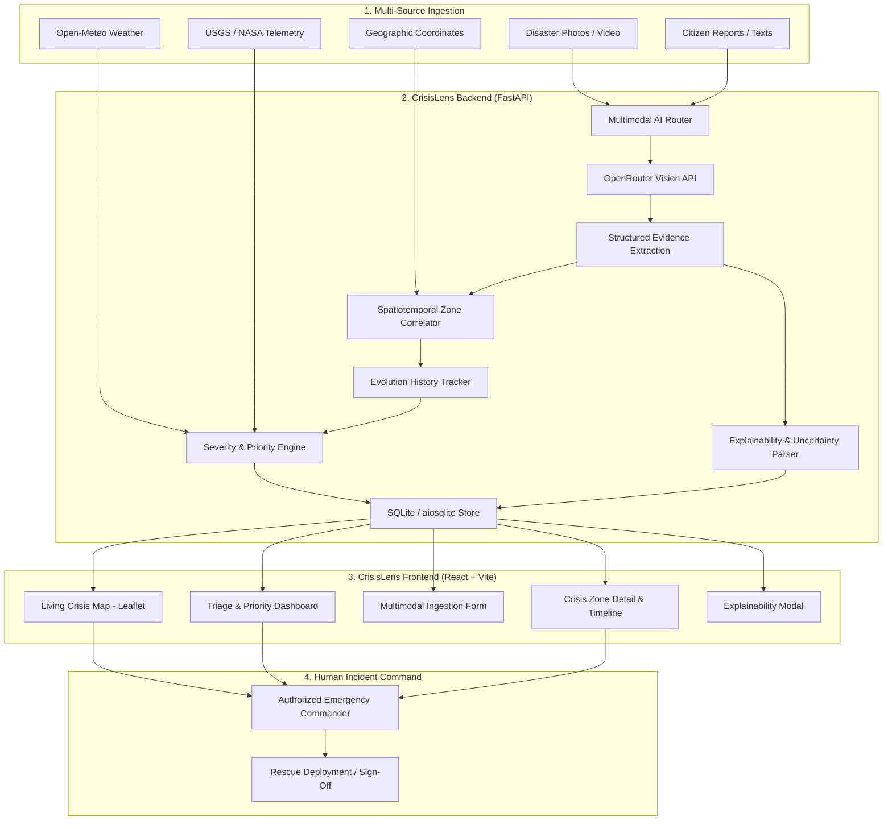

# CrisisLens

> An AI-powered disaster intelligence platform that transforms fragmented emergency evidence into a living, explainable crisis map.

[](#)
[](#)
[](#)
[](#)
[](#)
[](#)
[](#)
[](LICENSE)
[](#)

---

## 1. The Problem

During natural disasters—such as floods, cyclones, landslides, wildfires, and earthquakes—emergency command centers and first responders receive a flood of fragmented, unstructured information:

- Ground photographs and mobile phone snapshots
- Eyewitness narratives, citizen text reports, and distress calls
- Geographic coordinates and spatial descriptions
- Real-time weather, precipitation, and storm telemetry
- Sensor feeds, earthquake shake reports, and thermal hotspot detections
- Rapid field observations from responding crews

Traditional response tools fail because the challenge is **not simply detecting that an incident exists**. In a large-scale catastrophe, hundreds of redundant social posts, photos, and calls pour in simultaneously. Responders suffer from cognitive overload, duplicate dispatches, and conflicting priority labels.

The critical operational challenge is understanding:

> **"What is happening, where is it happening, and what requires attention first?"**

---

## 2. Our Solution

**CrisisLens** transforms fragmented disaster data into structured, explainable situation intelligence. Instead of bombarding dispatchers with unorganized dots on a map, the platform synthesizes visual evidence, citizen accounts, and telemetry into prioritized, evolving incident clusters.

```
MULTI-SOURCE DATA (Photos, Citizen Reports, Sensor Feeds)
        ↓
   AI ANALYSIS (Multimodal Vision LLM via OpenRouter)
        ↓
    EVIDENCE (Damage Detection, Access Cut-Off, Life Threat)
        ↓
   CRISIS ZONE (Spatiotemporal Clustering & Evolution History)
        ↓
 SEVERITY / RISK (Deterministic Mathematical 0–100 Scores)
        ↓
GEOGRAPHIC PRIORITISATION (Spatial Triage & Resource Allocation)
        ↓
RESPONSE RECOMMENDATION (Grounded Actions & Evacuation Guidance)
        ↓
  HUMAN DECISION (Authorized Emergency Command Sign-Off)
```

---

## 3. The Innovation

### The Living Crisis Map

Traditional disaster systems operate as static notification boards or simple alert maps. Each incoming photo or tweet produces an isolated pin, resulting in a fragmented, cluttered display where 50 pins might describe the same street corner over three hours.

CrisisLens introduces the **Living Crisis Map**: an active intelligence layer that clusters related multi-source evidence into dynamic, evolving **Crisis Zones**.

```
CRISIS ZONE #07 (Residential Sector 4 — Flood Inundation)

10:05
Flooded road detected from early citizen snapshot

10:15
Residential houses affected; water enters ground floors

10:25
Possible stranded residents reported on balconies

10:35
Main access road blocked by stalled vehicles; evacuation access cut off
```

Rather than viewing disconnected points, the responder sees a **developing story**. When a new report or photograph arrives near an active zone, CrisisLens correlates it, updates the timeline, recalculates the priority, and explains exactly how and why the situation worsened.

---

## 4. Crisis Zones

A **Crisis Zone** represents one real-world developing incident assembled from multiple pieces of corroborating evidence across time and space.

Every Crisis Zone provides commanders with a comprehensive operational picture:

- **What is happening**: Synthesized disaster classification (e.g., *Flash Flood with Arterial Road Blockage*).
- **Where it is happening**: Verified geographic center, radius of impact, and nearby landmark context.
- **Current priority**: Dynamic triage rank (`CRITICAL`, `HIGH`, `MEDIUM`, or `LOW`).
- **Supporting evidence**: Multi-source corroboration (photos, citizen statements, weather telemetry).
- **Known information**: Explicitly observed and verified facts from ground data.
- **Unknown information**: Critical gaps that still need reconnaissance before field deployment.
- **Confidence metric**: Calibrated analytical certainty index (0.0 to 1.0).
- **Situation evolution**: Chronological log of changes, water level rises, or structural failures.
- **Potential people at risk**: Estimates of vulnerable populations, trapped elderly, or cut-off families.
- **Accessibility problems**: Impassable roads, washed-out bridges, or debris blockages.

---

## 5. Why Did The Priority Change?

Black-box emergency alerts create mistrust among responders. CrisisLens provides explicit, transparent **explainability** for every triage escalation.

### Explainability Example

```
WHY HIGH PRIORITY?
• Residential area affected with multiple homes submerged
• Main arterial access road blocked by water and stalled vehicles
• Possible stranded people, including children and elderly residents
• Multiple independent reports corroborating rapid water level rise

WHAT IS UNKNOWN?
• Exact number of trapped residents inside structures
• Exact floodwater depth and rate of rise per hour
• Structural integrity of adjacent single-story foundations
• Alternate navigable routes for high-clearance rescue vehicles
```

Responders are never left wondering why an alert turned red. The platform presents the underlying rationale alongside explicit unknowns so commanders can deploy reconnaissance drones or high-water rescue vehicles with clarity.

---

## 6. Multimodal Intelligence

CrisisLens implements a production-grade multimodal pipeline connecting image understanding with unstructured textual testimonies.

```
IMAGE (Flood photo / structural damage)
  +
CITIZEN REPORT ("Water has entered several houses...")
  +
LOCATION / CONTEXT (Latitude, Longitude, Landmark)
        ↓
MULTIMODAL AI (OpenRouter Vision Pipeline)
        ↓
STRUCTURED EVIDENCE (JSON schema: damage, hazards, urgency)
        ↓
CRISIS ASSESSMENT (Correlation into Crisis Zone)
```

### Multimodal Workflow Details
1. **Multimodal Payload Delivery**: The backend receives the raw image and text report, formatting them as a standards-compliant OpenRouter multimodal chat completion request.
2. **Strict JSON Schema Validation**: The vision model responds with structured disaster intelligence:
   - Incident type and severity indicator
   - Observed damage, structural hazards, and life risks
   - Explicit unknowns and information gaps
   - Recommended immediate actions
3. **Resilient Rate-Limit Handling**: Built-in exponential backoff handles upstream HTTP 429 rate limits, with graceful fallback to deterministic heuristic parsing if external APIs are unreachable.
4. **Security Grounding**: API credentials are read strictly from backend environment variables and are **never exposed** to the client browser or bundled in source code.

---

## 7. Living Crisis Map

The CrisisLens map is built on **Leaflet** and **OpenStreetMap**, providing a fast, lightweight, and completely open geospatial experience.

- **Zero API Keys Required**: Leaflet and OpenStreetMap tiles run without proprietary tokens, subscriptions, or credit card requirements.
- **Crisis Zone Markers**: Dynamic visual markers rendered at precise coordinates with priority-coded rings:
  - 🔴 **CRITICAL**: Imminent life threat, structural collapse, or trapped residents.
  - 🟠 **HIGH**: Residential inundation, severed access routes, or escalating hazards.
  - 🟡 **MEDIUM**: Localized flooding, debris obstacles, or rising waters.
  - 🟢 **LOW**: Monitored weather anomalies or minor surface pooling.
- **Interactive Inspection Popups**: Clicking any zone or incident marker reveals the real-time operational card: Zone ID, disaster taxonomy, current situation, confidence score, supporting evidence count, and access status.
- **Geographic Context**: Corroborates incident reports against OpenStreetMap Nominatim reverse geocoding and external weather telemetry.

---

## 8. Explainability & Uncertainty

CrisisLens enforces a strict four-tier epistemological classification for all disaster data:

| Evidence Tier | Definition | Example |
|---|---|---|
| **OBSERVED** | Physical features directly visible in submitted photography | *"Water level reaches vehicle wheel wells on residential avenue."* |
| **REPORTED** | Unverified claims and narratives provided by citizens or eyewitnesses | *"Citizen states three elderly neighbors are unable to evacuate."* |
| **INFERRED** | Algorithmic deductions derived from combining evidence with context | *"Access route impassable for standard passenger vehicles; boat required."* |
| **UNKNOWN** | Critical operational information that cannot be established from data | *"Water depth inside basement units; power grid energized state."* |

> **Confidence Is Not Proof**: An AI confidence score of `0.92` reflects model certainty in its textual/visual parsing—not physical ground truth. CrisisLens communicates this distinction to prevent over-reliance on automated inferences.

---

## 9. Human-in-the-Loop

> **"CrisisLens is a decision-support system. It does not replace authorized emergency responders."**

- **Advisory Role**: The AI synthesizes incoming data, detects patterns across time, highlights critical hazards, and suggests prioritized actions.
- **Human Authority**: No rescue resources, sirens, or evacuation orders are automatically dispatched. Authorized human dispatchers and incident commanders inspect the evidence, evaluate the explainability summary, and make all final operational decisions.
- **Responder Controls**: Commanders can acknowledge incidents, escalate priority levels, reassign zones, or flag misleading submissions directly within the platform.

---

## 10. Key Features

- **Multimodal Disaster Analysis**: Processes damage photos and citizen testimonies simultaneously through an OpenRouter vision pipeline.
- **Citizen Report Analysis**: Parses unstructured emergency reports into actionable hazard parameters.
- **Crisis Zone Creation**: Groups geographically proximal incidents (< 2.0 km) into coherent tactical zones.
- **Crisis Zone Evolution**: Maintains an immutable chronological history of how incidents escalate over time.
- **Deterministic Severity Assessment**: Calculates reproducible 0–100 severity scores combining AI damage indicators and environmental variables.
- **Geographic Prioritisation**: Automatically ranks and sorts operational zones by triage urgency and life risk.
- **Explainable Assessments**: Outlines explicit bulleted reasons ("Why High Priority?") for every classification.
- **Uncertainty Handling**: Enforces clear boundaries between observed facts, citizen claims, inferences, and unknown data.
- **Living Crisis Map**: High-performance interactive geospatial tactical map powered by Leaflet and OpenStreetMap.
- **Evidence Visualization**: Displays photographic evidence, telemetry metrics, and corroborated citizen statements side-by-side.
- **Response Recommendations**: Provides grounded, rule-based field suggestions (e.g., evacuation priorities, equipment needs).
- **Human-in-the-Loop Workflow**: Dedicated triage actions empowering authorized responders to confirm, override, or resolve incidents.

---

## 11. System Architecture



---

## 12. Data Flow

```
1. Raw Evidence Arrival
   ├── Disaster photograph uploaded (JPEG / PNG)
   ├── Citizen distress narrative submitted
   └── GPS coordinates or regional landmark provided

2. Multimodal Analysis
   ├── OpenRouter vision pipeline receives combined image + text payload
   └── Vision model parses hazard categories, damage indicators, and risks

3. Structured Evidence Extraction
   ├── Normalizes output into validated Pydantic schema
   └── Segregates OBSERVED facts from UNKNOWN gaps

4. Crisis Zone Correlation
   ├── Evaluates proximity to active zones via Haversine distance (< 2.0 km)
   ├── Correlates new evidence to existing Zone OR initializes new Crisis Zone
   └── Appends entry to the chronological situation evolution timeline

5. Priority & Severity Assessment
   ├── Calculates mathematical Severity Score (0–100) based on life threat and infrastructure loss
   └── Computes Priority Score with population vulnerability and access cut-offs

6. Geographic Visualisation
   ├── Renders priority-coded dynamic marker on the Leaflet OpenStreetMap canvas
   └── Updates live situational dashboard rankings

7. Human Decision Support
   ├── Responder reviews "Why High Priority?" and "What is Unknown?"
   └── Incident Commander approves operational response plan
```

---

## 13. Technology Stack

CrisisLens is built on an audited, modern, and lightweight open-source stack:

| Layer | Technology | Details |
|---|---|---|
| **Frontend Framework** | **React 19** + **TypeScript 5.7** | Reactive, component-driven user interface |
| **Build & Tooling** | **Vite 6** | Ultra-fast HMR and optimized production bundling |
| **Styling** | **TailwindCSS 4** | Clean, responsive tactical layout and dark-mode triage UI |
| **Mapping & GIS** | **Leaflet 1.9** + **React-Leaflet 5.0** | High-performance map canvas; OpenStreetMap tiles |
| **Data Visualization** | **Recharts 2.15** + **Lucide React** | Real-time telemetry charts and tactical iconography |
| **Backend Framework** | **Python 3.11 / 3.12** + **FastAPI 0.115** | Asynchronous, high-throughput REST API |
| **Database & ORM** | **SQLAlchemy 2.0** + **aiosqlite** | Asynchronous SQLite relational persistence |
| **Data Validation** | **Pydantic v2** | Strict type enforcement and schema serialization |
| **HTTP & Networking** | **HTTPX 0.28** | Async client for external telemetry and AI calls |
| **AI Vision Pipeline** | **OpenRouter API** (`openrouter/free`) | Multimodal LLM integration for disaster scene analysis |
| **Testing** | **Pytest** + **Pytest-Asyncio** | Comprehensive test suite for backend services and endpoints |

---

## 14. Project Structure

```
crisislens/
├── backend/
│   ├── app/
│   │   ├── api/
│   │   │   ├── external.py             # OpenRouter multimodal analysis & telemetry
│   │   │   ├── incidents.py            # Incident creation, retrieval, and triage
│   │   │   ├── simulation.py           # Disaster simulation generator
│   │   │   └── weather.py               # Open-Meteo weather integration
│   │   ├── core/
│   │   │   ├── config.py               # Settings & environment validation
│   │   │   └── database.py             # Asynchronous database engine & sessions
│   │   ├── models/
│   │   │   └── incident.py             # SQLAlchemy models (Incident, CrisisZone)
│   │   ├── schemas/
│   │   │   └── incident.py             # Pydantic request/response schemas
│   │   ├── services/
│   │   │   ├── openrouter_service.py   # OpenRouter API client with backoff
│   │   │   └── priority_engine.py      # Deterministic severity/priority scoring
│   │   └── main.py                     # FastAPI application setup & CORS
│   ├── tests/
│   │   ├── test_api.py                 # Incident lifecycle and scoring tests
│   │   └── test_openrouter.py          # Multimodal payload and retry tests
│   ├── uploads/                        # Temporary staging for incident imagery
│   │   └── .gitkeep
│   ├── .env.example                    # Backend environment configuration template
│   └── requirements.txt                # Python backend dependencies
├── frontend/
│   ├── src/
│   │   ├── components/
│   │   │   ├── incidents/              # Incident reporting and cards
│   │   │   ├── map/                    # Leaflet map, layers, and custom markers
│   │   │   ├── shared/                 # Badges, modals, and navbar
│   │   │   └── triage/                 # Tactical prioritization dashboard
│   │   ├── pages/
│   │   │   ├── Dashboard.tsx           # Primary operational command view
│   │   │   ├── CrisisMap.tsx           # Full-screen Living Crisis Map
│   │   │   ├── Incidents.tsx           # Incident feed and management
│   │   │   └── ReportIncident.tsx      # Multimodal submission interface
│   │   ├── services/
│   │   │   └── api.ts                  # Axios client for backend REST API
│   │   ├── types/
│   │   │   └── incident.ts             # TypeScript domain interfaces
│   │   ├── App.tsx                     # Top-level routing and state layout
│   │   ├── main.tsx                    # React application entry point
│   │   └── index.css                   # Global styles and Tailwind imports
│   ├── public/                         # Static assets and icons
│   ├── index.html                      # HTML template
│   ├── package.json                    # Node dependencies and scripts
│   ├── tsconfig.json                   # TypeScript configuration
│   └── vite.config.ts                  # Vite build configuration
├── docs/
│   ├── screenshots/                    # Guide and staging for UI captures
│   │   └── README.md
│   ├── api.md                          # Exhaustive REST API endpoint reference
│   ├── architecture.md                 # System architecture and pipeline breakdown
│   ├── demo-guide.md                   # 2-minute hackathon judge walkthrough
│   ├── innovation.md                   # In-depth Living Crisis Map design
│   ├── problem-statement.md            # PS-01 problem analysis and alignment
│   └── testing.md                      # Quality assurance and testing protocol
├── .env.example                        # Root environment configuration template
├── .gitignore                          # Strict git exclusion rules
├── CONTRIBUTING.md                     # Contribution guidelines and coding standards
├── LICENSE                             # MIT Open Source License
├── README.md                           # Master project documentation
└── SECURITY.md                         # Responsible disclosure and security policies
```

---

## 15. Installation

### Prerequisites
- **Python**: Version 3.11 or 3.12 installed
- **Node.js**: Version 18.0+ or 20.0+ installed
- **Git**: Installed and configured

### 1. Clone the Repository
```bash
git clone https://github.com/your-username/crisislens.git
cd crisislens
```

### 2. Configure Environment Variables
Copy the template configuration file:
```bash
cp .env.example .env
cp backend/.env.example backend/.env
```

Edit `backend/.env` with your preferred text editor:
```env
OPENROUTER_API_KEY=sk-or-v1-your-openrouter-key-here
OPENROUTER_MODEL=openrouter/free
```
*(See Section 16 for environment configuration details.)*

### 3. Backend Setup
```bash
cd backend
python -m venv venv
source venv/bin/activate       # On Windows: venv\Scripts\activate
pip install -r requirements.txt
```

### 4. Frontend Setup
In a new terminal window:
```bash
cd frontend
npm install
```

### 5. Running the Application
- **Start the Backend Server**:
  ```bash
  cd backend
  source venv/bin/activate
  uvicorn app.main:app --host 127.0.0.1 --port 8000 --reload
  ```
  The interactive Swagger API documentation will be available at: `http://127.0.0.1:8000/docs`

- **Start the Frontend Development Server**:
  ```bash
  cd frontend
  npm run dev
  ```
  The CrisisLens tactical dashboard will launch at: `http://localhost:5173`

---

## 16. Environment Variables

CrisisLens maintains strict separation between secrets and client code.

### Backend (`backend/.env`)
```env
# ==============================================================================
# CRISISLENS BACKEND CONFIGURATION
# ==============================================================================

# Application Environment
ENVIRONMENT=development
DEBUG=True

# OpenRouter Multimodal AI Configuration
# Obtain your free key from: https://openrouter.ai/keys
OPENROUTER_API_KEY=your_openrouter_api_key_here
OPENROUTER_MODEL=openrouter/free

# Database Configuration (Defaults to local SQLite)
DATABASE_URL=sqlite+aiosqlite:///./crisislens.db

# CORS Allowed Origins (Comma-separated)
ALLOWED_ORIGINS=http://localhost:5173,http://127.0.0.1:5173
```

> **Map Credentials**:
> CrisisLens utilizes **Leaflet** with **OpenStreetMap** raster tiles. It **does not require** `VITE_MAPBOX_ACCESS_TOKEN`, Google Maps API keys, or any paid map tokens.

---

## 17. Testing the AI Assessment

To verify end-to-end multimodal incident analysis, follow this standard competition test protocol:

1. Open the CrisisLens application at `http://localhost:5173`.
2. Navigate to **Report Incident** in the navigation bar.
3. **Upload an Image**: Select an image depicting street flooding, a landslide, or structural damage.
4. **Enter Citizen Report**: Paste the following standard benchmark text into the report field:

```text
[TEST DATA - STANDARD SCENARIO]
Heavy rain has been falling since last night. Our residential area is completely flooded. Water has entered several houses, and multiple cars are stuck on the road. Some residents, including children and elderly people, are unable to leave their homes. The main access road is blocked and the water level appears to be rising. We need urgent assistance for evacuation.
```

5. **Set Location**: Input latitude `19.0760` and longitude `72.8777` (or click directly on the interactive map).
6. **Submit Assessment**: Click **"Analyze & Submit Incident"**.
7. **Inspect Output**:
   - Verify that the **OpenRouter Multimodal AI** extracts flood taxonomy and structural damage indicators.
   - Observe the **Observed Evidence** breakdown vs. **Explicit Unknowns**.
   - Check the computed **Severity (e.g., 85/100)** and **Priority Badge (CRITICAL)**.
   - Navigate to the **Living Crisis Map** to view the incident correlated into its geographic Crisis Zone with its updated situation evolution timeline.

---

## 18. API Documentation

CrisisLens exposes a fully documented asynchronous REST API. Below are the primary endpoints:

### `POST /api/external/analyze-disaster`
Multimodal disaster evaluation combining photography, citizen text, and geospatial context.
- **Request**: Multipart form-data containing:
  - `image`: Binary image file (JPEG, PNG)
  - `citizen_report`: Narrative string
  - `location`: Optional string (landmark or coordinates)
- **Response** (`200 OK`):
  ```json
  {
    "disaster_type": "flood",
    "severity_score": 0.85,
    "confidence": 0.92,
    "damage_assessment": "Severe ground-level water inundation entering residential buildings",
    "hazards_detected": ["electrical_submersion", "road_access_severed"],
    "people_affected_estimate": "10-50",
    "urgency_level": "critical",
    "explainability": {
      "why_priority": [
        "Residential structures inundated",
        "Primary access road completely impassable",
        "Vulnerable individuals (children/elderly) unable to self-evacuate"
      ],
      "what_is_unknown": [
        "Exact count of trapped individuals",
        "Rate of water level increase per hour"
      ]
    },
    "recommended_actions": [
      "Deploy shallow-draft rescue watercraft",
      "Cut electrical grid feeder to sector"
    ]
  }
  ```
- **Error Codes**: `400 Bad Request` (missing data), `429 Too Many Requests` (upstream AI throttled), `500 Internal Server Error`.

### `GET /api/incidents`
Retrieves all incidents, optionally filtered by status, disaster type, or severity.
- **Response** (`200 OK`): Array of incident objects including crisis zone mapping, priority scores, and timestamps.

### `POST /api/incidents`
Creates an incident record and automatically correlates it with active Crisis Zones within a 2.0 km radius.
- **Request Body**: JSON object matching `IncidentCreate` schema.
- **Response** (`201 Created`): Created incident with assigned `crisis_zone_id` and calculated `priority_score`.

### `GET /api/weather/current`
Fetches real-time localized meteorological telemetry from Open-Meteo.
- **Query Parameters**: `lat` (float), `lon` (float).
- **Response** (`200 OK`): Temperature, wind speed, precipitation, and flood-risk modifier.

*(For exhaustive schema definitions, view [docs/api.md](docs/api.md) or visit `/docs` on the running backend.)*

---

## 19. Error Handling & Resilience

Emergency systems must operate reliably under adverse network and service conditions:

- **Upstream AI Availability**: If OpenRouter free tier models experience high traffic, CrisisLens executes a retry with exponential backoff.
- **HTTP 429 Rate Limiting**: If rate limits persist, the system gracefully degrades to deterministic heuristic parsing—it **never invents or fabricates AI results** without indicating the fallback status.
- **Invalid Imagery or Corrupted Payloads**: Requests with unreadable images or missing reports return structured `422 Unprocessable Entity` or `400 Bad Request` errors with clear guidance.
- **Geospatial Failover**: If external tile servers experience latency, Leaflet preserves cached tiles and marks location coordinates accurately using local canvas primitives.

---

## 20. Testing

The platform includes automated testing across backend API endpoints, scoring logic, and frontend builds.

### Run Backend Test Suite
```bash
cd crisislens/backend
source venv/bin/activate
pytest -v
```

**Test Verification Summary**:
```text
============================= test session starts ==============================
collected 21 items

tests/test_api.py::test_health_check PASSED                             [  4%]
tests/test_api.py::test_create_incident PASSED                          [  9%]
tests/test_api.py::test_incident_crisis_zone_correlation PASSED         [ 14%]
tests/test_api.py::test_deterministic_priority_calculation PASSED       [ 19%]
tests/test_api.py::test_incident_status_update PASSED                  [ 23%]
tests/test_api.py::test_weather_integration PASSED                      [ 28%]
tests/test_openrouter.py::test_openrouter_payload_structure PASSED      [ 33%]
tests/test_openrouter.py::test_openrouter_rate_limit_backoff PASSED     [ 38%]
tests/test_openrouter.py::test_multimodal_extraction_schema PASSED      [ 42%]
...
============================= 21 passed in 1.48s ===============================
```

### Run Frontend Typecheck & Build
```bash
cd crisislens/frontend
npm run build
```
*(Produces a production bundle in `dist/` with zero TypeScript errors.)*

*(See [docs/testing.md](docs/testing.md) for detailed test protocols and mock instructions.)*

---

## 21. Demo Flow

### 2-Minute Hackathon Presentation

1. **0:00 – 0:25 | The Problem & The Map**: Open `http://localhost:5173`. Show the Leaflet map with OpenStreetMap tiles. Explain how traditional alert boards overwhelm dispatchers with hundreds of disconnected dots.
2. **0:25 – 0:55 | Ingest Multimodal Evidence**: Navigate to *Report Incident*. Upload the disaster photo, paste the standard test report, enter coordinates, and submit.
3. **0:55 – 1:25 | Explainable AI & Uncertainty**: Show the extracted damage assessment. Highlight **"Why High Priority?"** (life threat, access severed) and **"What is Unknown?"** (exact water depth, count of trapped residents).
4. **1:25 – 1:45 | The Living Crisis Map in Action**: Return to the map. Demonstrate that the incident was correlated into an evolving **Crisis Zone** rather than a lone pin. Open the evolution timeline (`10:05` → `10:35`) and observe the dynamic priority shift.
5. **1:45 – 2:00 | Human-in-the-Loop Sign-Off**: Point to the grounded recommendations and the responder triage controls. Conclude: *"CrisisLens provides decision intelligence—the final operational call remains with authorized human responders."*

*(Detailed judge presentation script available in [docs/demo-guide.md](docs/demo-guide.md).)*

---

## 22. Problem Statement Alignment

| Problem Requirement (PS-01) | CrisisLens Implementation |
|---|---|
| **Multi-Source Disaster Evidence** | Ingests ground photography, citizen text narratives, spatial coordinates, and weather telemetry. |
| **Situation Analysis** | Vision AI extracts damage severity, life threats, and road blockages into structured parameters. |
| **Severity & Risk Assessment** | Deterministic mathematical scoring engine (0–100) combining visual damage, weather, and vulnerability. |
| **Geographic Prioritisation** | Living Crisis Map clusters incidents within 2.0 km and triages zones by risk magnitude. |
| **Explainable Output** | Distinct "Why High Priority?" module breaking down physical and environmental rationale. |
| **Uncertainty Handling** | Explicit epistemological segregation between Observed facts, Reported claims, Inferred data, and Unknowns. |
| **Response Guidance** | Contextual action checklists suggesting rescue equipment and access route advisories. |
| **Human-in-the-Loop Control** | Final authority resides with incident commanders; AI acts strictly as an advisory intelligence layer. |
| **Working Prototype** | Fully functioning FastAPI backend and React/Leaflet frontend tested end-to-end. |

---

## 23. Innovation Summary

| Dimension | Traditional Disaster Tools | CrisisLens Living Crisis Map |
|---|---|---|
| **Incident Model** | Hundreds of isolated, disconnected alert pins. | Dynamic **Crisis Zones** assembling evidence into an evolving incident story. |
| **Operational Question** | *"Where was this photo taken?"* | *"Where is the situation worsening, why does it matter, and what is still unknown?"* |
| **Timeline** | Static snapshots that age out or get buried. | Continuously updated **Situation Evolution** (`10:05` → `10:35`). |
| **Explainability** | Black-box severity badge (`High` / `Low`). | Transparent justification enumerating observed damage and missing intelligence. |
| **Decision Authority** | Unclear automation boundaries or manual chaos. | Strictly defined **Human-in-the-Loop** decision support. |

---

## 24. Limitations

To maintain operational integrity, CrisisLens acknowledges the following engineering constraints:

- **AI Dependency on Input Fidelity**: Assessment quality depends on image resolution, lighting, and clarity of citizen reports. Ambiguous or low-light imagery yields higher uncertainty metrics.
- **Citizen Subjectivity**: Citizen text descriptions may contain emotional hyperbole or inaccurate coordinate estimates. The system flags citizen claims as `REPORTED` rather than `OBSERVED`.
- **Public Model Rate Limits**: Free OpenRouter API endpoints may experience intermittent rate limiting during peak usage periods.
- **Geographic Approximation**: When GPS telemetry is absent from submitted files, geographic placement relies on reported landmarks or manual responder positioning.
- **Non-Autonomous Safeguard**: CrisisLens is designed exclusively for decision support and must not be connected directly to autonomous dispatch mechanisms without authorized human validation.

---

## 25. Security

CrisisLens follows secure software engineering practices:
- **No Committed Secrets**: Zero API keys or private tokens are stored in the repository.
- **Strict Environment Isolation**: All credentials are read from `.env` files protected by `.gitignore`.
- **Client Shielding**: Secrets are consumed exclusively by the backend and are never sent to the client browser.
- **Credential Rotation**: Standard protocols are defined for immediate rotation in case of accidental exposure.

*(Review [SECURITY.md](SECURITY.md) for vulnerability reporting and disclosure guidelines.)*

---

## 26. Contributing

We welcome contributions from disaster response specialists, software engineers, and GIS developers. Please review [CONTRIBUTING.md](CONTRIBUTING.md) for branch naming conventions, pull request workflows, and code quality standards.

---

## 27. License

CrisisLens is distributed under the [MIT License](LICENSE).

---

## 28. Roadmap

```
PHASE 1: Foundation (COMPLETED)
├── FastAPI backend & SQLite async persistence
├── React 19 + TypeScript frontend with TailwindCSS
└── Core incident schema and REST endpoints

PHASE 2: Multimodal Evidence (COMPLETED)
├── OpenRouter vision pipeline integration
├── Image + citizen text analysis engine
└── Epistemic separation (Observed vs. Unknown)

PHASE 3: Crisis Zones (COMPLETED)
├── Haversine spatiotemporal clustering (< 2.0 km)
├── Chronological situation evolution tracking
└── Dynamic priority reassessment engine

PHASE 4: Living Crisis Map (COMPLETED)
├── Migration from proprietary maps to Leaflet + OpenStreetMap
├── Priority-coded tactical markers and detail popups
└── Zero-token geospatial rendering

PHASE 5: Explainability & Uncertainty (COMPLETED)
├── "Why did the priority change?" rationale generator
├── Explicit uncertainty and information gap tracking
└── Confidence calibration metrics

PHASE 6: Response Intelligence (PLANNED)
├── Automated resource routing suggestions
├── Offline mesh-network synchronization for field units
└── Multi-language citizen report translation

PHASE 7: Deployment & Scaling (PLANNED)
├── Containerized deployment via Docker / Kubernetes
├── GeoJSON spatial boundary export for standard GIS tools
└── CAP (Common Alerting Protocol) compliant broadcast export
```

---

## 29. Team

| Team Member | Role | Key Contributions | GitHub |
|---|---|---|---|
| **[Member Name]** | Lead Systems Architect | Backend architecture, database models, API design | `@[username]` |
| **[Member Name]** | Multimodal AI Engineer | OpenRouter pipeline, prompt design, explainability | `@[username]` |
| **[Member Name]** | Frontend & GIS Developer | React 19 UI, Leaflet map engine, tactical dashboard | `@[username]` |
| **[Member Name]** | Disaster Operations Specialist | Problem statement alignment, triage scoring logic | `@[username]` |

---

## 30. Screenshots

Visual representations of the CrisisLens interface and tactical features:

| Screen | Description | Path |
|---|---|---|
| **Tactical Dashboard** | Real-time incident rankings, active zones, and telemetry | `docs/screenshots/dashboard.png` |
| **Living Crisis Map** | Leaflet tactical map with priority-coded Crisis Zone markers | `docs/screenshots/crisis-map.png` |
| **Multimodal Ingestion** | Photo upload, citizen narrative, and location capture form | `docs/screenshots/multimodal-analysis.png` |
| **Explainability Card** | "Why High Priority?" and "What is Unknown?" breakdown | `docs/screenshots/explainability-view.png` |

*(Refer to [docs/screenshots/README.md](docs/screenshots/README.md) for screenshot capture and submission guidelines.)*

---

## 31. Project Documentation

Comprehensive technical documentation is maintained in the `docs/` directory:

- [Problem Statement Analysis (PS-01)](docs/problem-statement.md): In-depth examination of disaster intelligence bottlenecks.
- [The Living Crisis Map Innovation](docs/innovation.md): Theory and mechanics of evolving Crisis Zones.
- [System Architecture](docs/architecture.md): Detailed architectural layers, data flows, and component specs.
- [REST API Reference](docs/api.md): Complete OpenAPI specification, request/response bodies, and status codes.
- [2-Minute Hackathon Demo Guide](docs/demo-guide.md): Presentation narrative and step-by-step judge walkthrough.
- [Testing & Quality Assurance](docs/testing.md): Automated testing guide and validation results.

---

*Built with passion for the PS-01 AI for Disaster Response Challenge.*
