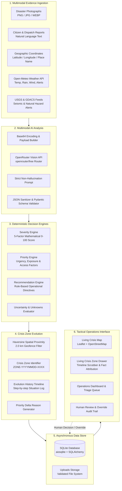

# System Architecture & Technical Design

## 1. High-Level Architecture Overview

CrisisLens is built as an asynchronous, modular decision-support system comprising a **FastAPI backend** and a **React 19 / TypeScript frontend** backed by **Leaflet + OpenStreetMap**.

---

## 2. Component Breakdown

### A. Multimodal AI Pipeline (`app/services/openrouter_service.py`)
- **Dual Ingestion**: Processes photographic images (converted to base64 Data URLs) alongside free-form citizen text descriptions.
- **Provider Routing**: Connects to OpenRouter's vision router (`openrouter/free`) with automatic single-retry backoff upon encountering upstream rate limits (HTTP 429).
- **Non-Hallucination Guardrails**:
  - Requires explicit output of observed conditions vs. unconfirmed unknowns.
  - Generates confidence scores that reflect model certainty rather than ground truth.
- **Data Conversion**: Maps structured outputs into CrisisLens internal schemas for mathematical scoring.

### B. Deterministic Decision Engines (`app/engines/`)
To preserve auditability and prevent black-box unpredictability, scores are calculated deterministically rather than generated by the LLM:
1. **Severity Engine (`severity_engine.py`)**:
   $$S = \sum w_i \cdot f_i \quad (\text{Max: } 100)$$
   Evaluates People Impact (30%), Infrastructure Damage (20%), Immediate Hazards (20%), Accessibility (15%), and Environmental Risk (15%).
2. **Priority Engine (`priority_engine.py`)**:
   Combines Severity $(S)$, Population Exposure $(E)$, Time-Sensitive Urgency $(U)$, and Transit Impediments $(A)$ to produce tactical triage ranking.
3. **Recommendation Engine (`recommendation_engine.py`)**:
   Generates actionable emergency response directives (e.g., *"Deploy watercraft rescue team"*, *"Establish alternate transit bypass"*).

### C. Crisis Zone Correlation Engine (`app/services/crisis_zone_service.py`)
- Computes spherical great-circle distances using the Haversine formula.
- Groups incident reports within 2.0 km into an existing Crisis Zone.
- Maintains an immutable `evolution_history` JSON array preserving timestamped snapshots of how the crisis developed.

### D. Tactical Map Frontend (`frontend/src/components/map/`)
- Powered by **Leaflet 1.9** and **React-Leaflet 5.0**.
- Renders standard OpenStreetMap tiles (`https://{s}.tile.openstreetmap.org/{z}/{x}/{y}.png`) with zero API keys required.
- Custom `L.divIcon` pins render rich HTML/SVG markers with priority badges (`CRIT`, `HIGH`, `MED`, `LOW`), update counters, and SVG icons.
- Interactive slide-out **Living Crisis Zone Drawer** exposes the multi-step timeline, "Why [Priority] Priority?", and fact categorization.
